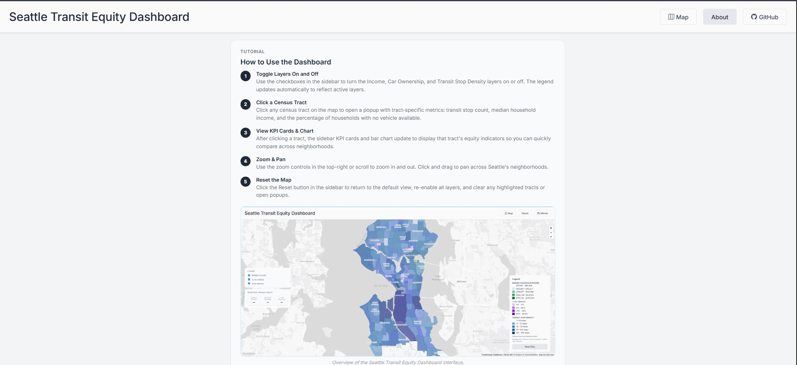
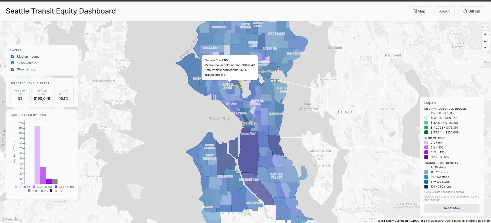

# Seattle Transit Equity Dashboard

## AI Disclosure: We used AI to join both the datasets used for map stop density and the third map being no vehicle

### By: Katherine Escoto Licona, Shayla Guieb, Oscar Castillo, Jiali Deng

[Seattle Transit Equity Dashboard Link](https://sjg2202.github.io/transit-equity-dashboard/)

## Project Description

Purpose of the dashboard is to be able to showcase transit desserts meaning places where there is limited access to transit access such as public transportation. With the help of the maps made for the dashboard it helps to look at some transit barriers that can be impacted by having no vechicles, stop density and median income.

> This is our about page above that contains an overview of how the Seattle Transit Equity Dashboard works and purpose of our project. It includes also a tutorial as seen in the image of how to interact with the each layer in the map page when you click on it.

> When using the map you need to zoom in to census tract to be able to populate the chart on the left hand side of the dashboard. You can also toggle on what layer you want to focus such as Median income, % no vechicle and stop density. The map also populates on the left hand side the number of transit stops, median income and % no vechicle.

## Project Goal
The message we want to deliver through our project is to be able to provide information for community advocates and transportation equity organization that could be able to look at the transit desserts and barries that can be identified through the data that we have collected and vizualized through our map and in our dashboard interface.

## Projection
Map projection, map zoom levels, center: Projection will be EPSG: 3857. Our map will be centered on Seattle at longitude -122.3321, latitude 47.6062. Likewise, the initial zoom level of our map will be approximately 11.

## Description of the thematic layers that can be toggled from on the map:
Layer 1: Transit Stop Density by Census Tract Used visual strategies: Choropleth map using a sequential color palette to show variation in transit stop density across Seattle census tracts. Supporting data sets for each thematic map layer: 2020 Seattle Census Tract Boundaries GeoJSON loaded as a polygon layer and King County Metro Stop GeoJSON loaded as a point layer, both added directly as sources in Mapbox GL JS within index.html. Vector or raster layer. If it is a vector, which data attribute to use? If raster, which zoom level and presumed bounding box to use: Vector layer. The census tract boundaries use the GeoID attribute to identify each tract, while the transit stop points use their coordinate geometry to determine which tract they fall within.

Layer 2: Median Household Income by Census Tract Used visual strategies: We will use the Choropleth Map where color intensity represents income levels. This will be classified as Natural Breaks (Jenks) to best highlight the economic disparity between neighborhoods.

Supporting data sets for each thematic map layer: ACS 2024 5-Year Estimates (Median Household Income in the Past 12 Months). The base geography layer will be pulled from the Tiger/Line 2024 Census Tract Shapefiles (Filtered to King County, FIPS 033). Vector or raster layer. If it is a vector, which data attribute to use? If raster, which zoom level and presumed bounding box to use: This layer will use a Vector layer, GeoJSON/Shapefile format, B19013_001E (Estimated Median Household Income) data attribute to showcase color ramp for each census tract. Seattle neighborhood boundaries were obtained from the City of Seattle Neighborhood Map Atlas dataset and used to clip King County census tracts to the Seattle study area.

Layer 3: Car Ownership Rate by Census Tract Used visual strategies: We will use the Choropleth map to represent the density of transit-dependent households. Darker color saturation will represent areas with higher percentages of zero-vehicle households. Supporting data sets for each thematic map layer: ACS 2024 5-Year Estimate (Household Size by Vehicles Available), specifically the "Zero Vehicle households" to determine transit necessity. Vector or raster layer. If it is a vector, which data attribute to use? If raster, which zoom level and presumed bounding box to use: We will use a Vector layer, specifically the GeoJSON format for Mapbox compatibility. Focusing on "Zero vehicle households; Pct_No_Vehicle", the percentage of households with zero vehicles available per tract, ensuring an accurate comparison across different population densities.

## Libraries & services used
- QGIS to clean and join dataset.
-  We used AI to join census tract geojson with transit stop points. We also used AI to join census tract geojson with household size by vechicles avalible.
- For making charts we used [c3 min js](https://c3js.org/) to be able to make the chosen chart and also [d3.js](https://d3js.org/) to be able to help customize the chart.

- Mapbox for the basemap using Mapbox GL JS v2.15.15.0: [Mapbox gl js docs](https://docs.mapbox.com/mapbox-gl-js/guides/)

## Data Sources

[B08201: Household Size by Vehicles Available](https://data.census.gov/table/ACSDT1Y2024.B08201?q=B08201:+Household+Size+by+Vehicles+Available)

[2020 Seattle Census Tract Boundaries (GeoJSON)](https://data-seattlecitygis.opendata.arcgis.com/datasets/SeattleCityGIS::2020-census-tracts-seattle/explore)

[King County Transit Stops](https://gis-kingcounty.opendata.arcgis.com/datasets/554131a77997491bb84114223da5511d/explore?location=47.560985%2C-122.042655%2C10)

[Neighborhoods Map Atlas (Geojson)](https://data-seattlecitygis.opendata.arcgis.com/datasets/SeattleCityGIS::neighborhood-map-atlas-neighborhoods/explore?location=47.614610%2C-122.336918%2C11)

[B19013_001E Estimated Median Household Income](https://data.census.gov/table/ACSDT5Y2024.B19013?q=b19013&g=050XX00US53033%241400000&y=2024&moe=false)

## Acknowledgements

We would like to ackowledge Liz Peng for being able to giving us feedback on our project and being able to support us in reviewing our project.

